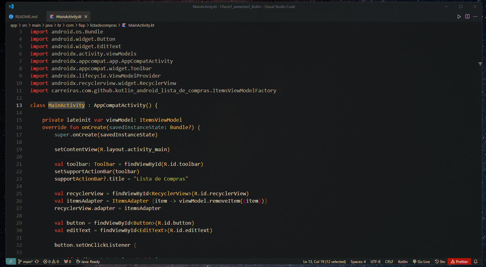
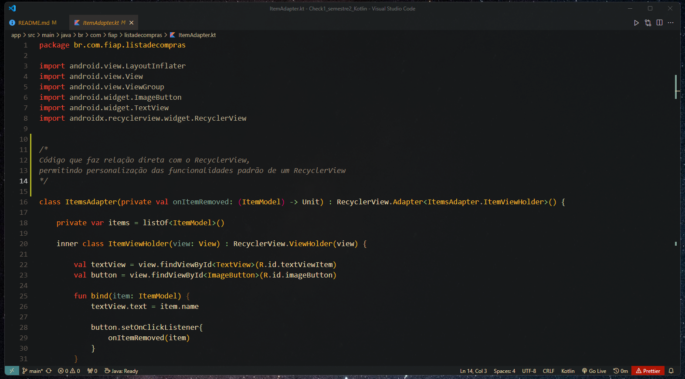
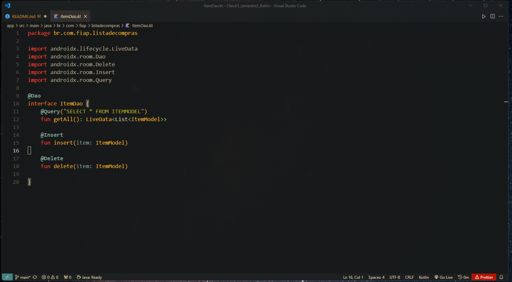
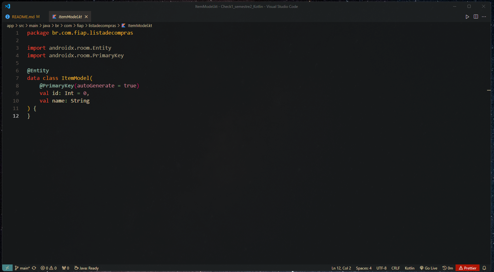
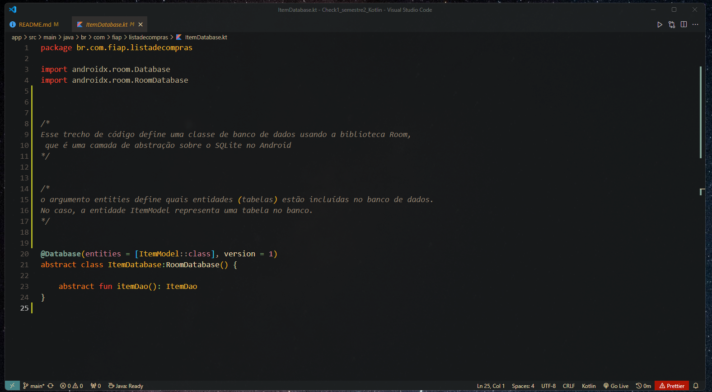
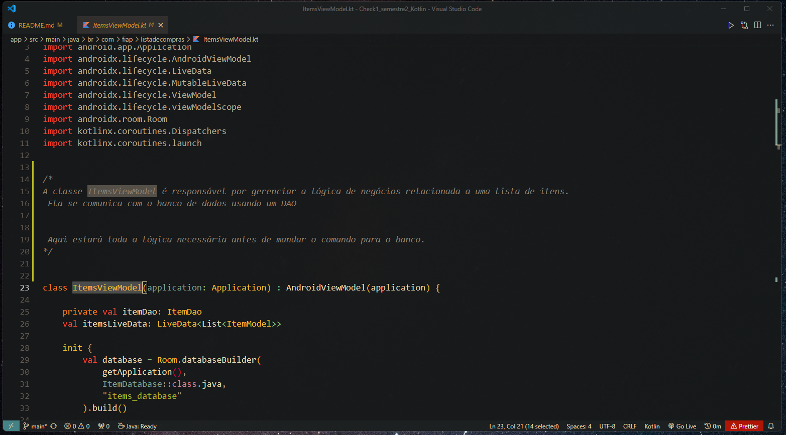
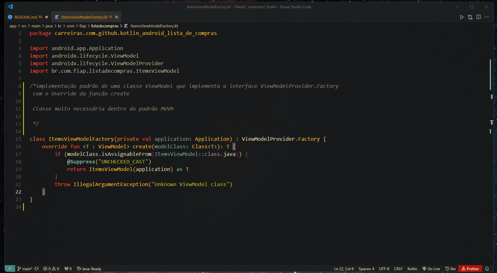

# Check1_semestre2_Kotlin

## MainActivity
Kotlin file que será executado pelo aplicativo, nosso código principal:

## ItemAdapter
Faz relação com o RecyclerView (da biblioteca do androidx):

- Personalização e enriquecimento de comandos principais

## ItemDao
DAO - Conceito já conhecido, é uma Data Access Object, ou seja, responsável por fazer a comunicação entre o banco de dados (SQLite) e o programa.

É através dela que iremos executar nossos comandos de banco.

Curiosidade: Temos umas anotações que já facilitam nossa vida como

- @Insert
- @Delete

## ItemModel

Modelo/Entidade que trabalharemos, é a classe que define as características do objeto principal do nosso código.

ItemDAO se baseia nela para os comandos em banco de dados.

## ItemDatabase
Classe que se relaciona com o SQLite através da biblioteca **Room**

## ItemViewModel
Entrando mais ainda no padrão MVVM, temos uma classe ViewModel que define toda a lógica por trás dos comandos do banco.

Ou seja, nenhum comando para o banco será executado antes de passar por aqui. E é aqui que a lógica será inserida

## ItemViewModelFactory

Conceito um tanto difícil, mas o que sabemos é que é uma classe necessária dentro do padrão MVVM

## Destaque Especial para conceito:

### LiveData:
> Componente do androidx.lifecycle

Foi um conceito muito difícil de compreender num primeiro momento, até mesmo implementando com os commits do professor.

Mas de forma resumida ele garante uma fluidez e desempenho muito melhor para o App quando temos que trabalhar com visuais "scroláveis". Isso porque ele só permite o carregamento de elementos que está num status ativo/visíveis.

Ou seja, se está em "segundo plano" não tem porque atualizar e comprometer o desempenho e a prioridade de quem está em "primeiro plano".
